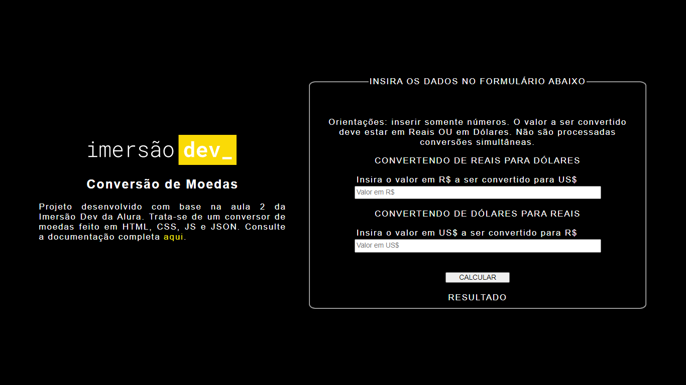

# CONVERSOR DE MOEDAS 

## SUMARIO

   * [Descrição do Projeto Original](#DESCRIÇÃO-DO-PROJETO-ORIGINAL)
   * [Alterações](#ALTERAÇÕES)
   * [Deploy](#DEPLOY)
   * [Linguagens e ferramentas utilizadas](#LINGUAGENS-E-FERRAMENTAS-UTILIZADAS)
   * [Considerações](#CONSIDERAÇÕES)

## DESCRIÇÃO DO PROJETO ORIGINAL

Projeto desenvolvido com base na segunda aula da Imersão DEV, evento produzido pela Alura em Setembro de 2021.

O projeto original pode ser visualizado no <a target="_blank" href="https://codepen.io/imersao-dev/pen/zYNOZRX">Codepen</a>. Trata-se de um conversor de valores com entrada de dados através de formulário e saída diretamente no HTML. No projeto original, o valor de cotação é alimentado manualmente no arquivo JS.

## ALTERAÇÕES

Usando o projeto original como base, fiz algumas alterações: 

- O layout foi alterado para ser exibido em duas colunas, utilizando a propriedade flexbox no CSS. 
- Foram usadas estruturas de seleção aninhadas para gerar mensagens de retorno nos casos em que a entrada de dados não estiver correta (botão pressionado sem inserção de valores, inclusão de valores em dois campos simultaneamente ou valores negativos). No projeto original, por exemplo, o acionamento do botão sem a digitação retornava NaN.  
- O valor de cotação é recuperado através de API disponibilizada pelo Banco Central, com informações atualizadas em D-1.

## DEPLOY

O deploy está disponível <a target="_blank" href="https://convertendodolares.netlify.app/">aqui</a>.

## LINGUAGENS E FERRAMENTAS UTILIZADAS

Foram usados no projeto: HTML5, CSS3, Javascript e JSON. Utilizei no projeto o VS Code e o Github desktop. 

## CONSIDERAÇÕES

Em andamento. 