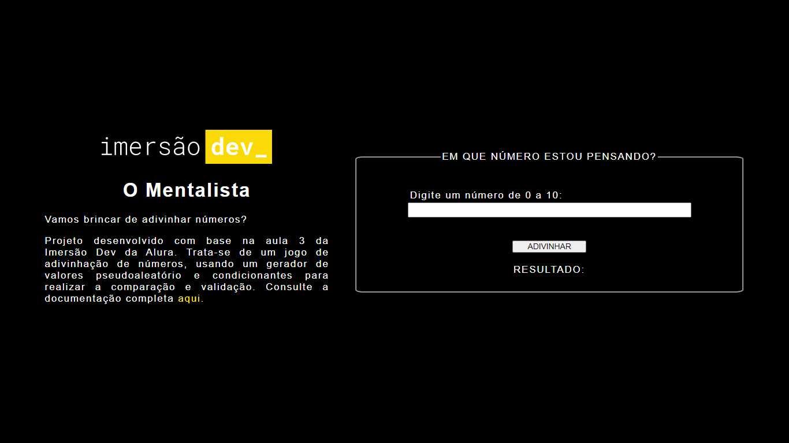

# O MENTALISTA 

## SUMARIO

   * [Descrição do Projeto Original](#DESCRIÇÃO-DO-PROJETO-ORIGINAL)
   * [Alterações](#ALTERAÇÕES)
   * [Deploy](#DEPLOY)
   * [Linguagens e ferramentas utilizadas](#LINGUAGENS-E-FERRAMENTAS-UTILIZADAS)
   * [Considerações](#CONSIDERAÇÕES)

## DESCRIÇÃO DO PROJETO ORIGINAL

Projeto desenvolvido com base na terceira aula da Imersão DEV, evento produzido pela Alura em Setembro de 2021.

O projeto original pode ser visualizado no <a target="_blank" href="https://codepen.io/imersao-dev/pen/BaZwpPr">Codepen</a>. Trata-se de um jogo de adivinhação de números. 

## ALTERAÇÕES

Usando o projeto original como base, fiz algumas alterações: 

- O layout foi alterado para ser exibido em duas colunas, utilizando a propriedade flexbox no CSS. 
- O valor sorteado é exibido na página junto com o resultado de erro ou acerto.   

## DEPLOY

O deploy está disponível <a target="_blank" href="https://mentalistaimersaodev.netlify.app/">aqui</a>.

## LINGUAGENS E FERRAMENTAS UTILIZADAS

Foram usados no projeto: HTML5, CSS3, Javascript. Utilizei no projeto o VS Code e o Github desktop. 

## CONSIDERAÇÕES

Em andamento. 